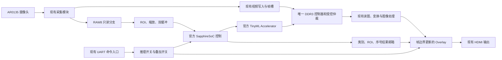

# 以官方 YOLO EVSoC 为基础的双链路集成

2026-10-04。落实用户指定的 EVSoC 工程路线；此文件是集成约束和源文件映射，不表示系统已经上板运行。

## 已固定的基线

- 视频基线：独立副本 `CNN-Tutorial-FPGA/example_top.v`，保持 AR0135、现有 DDR3、图像处理、HDMI 和 UART 协议。原 `fpga-w.-codex` 不修改。
- AI 基线：用户桌面 `tinyml-main/tinyml_vision/Ti60F225_yolo_person_detect_demo`。`main.cc`、`edge_vision_soc.v` 与固定官方 2026.1 源码去除换行差异后相同。
- 工作副本：`CNN-Tutorial-FPGA/artifacts/evsoc-gesture-r1`。源文件哈希见 `integration_manifest.json`；原顶层和官方 main 另存 `reference_original/`，用于最小差异审阅。
- 模型：已冻结的 64×64×1 INT8 灰度手势分类，26,371 参数、33,240 字节。类别顺序 paper、rock、scissors。保持现有 AR0135；当前分类模型不输出目标检测框。
- 依据：`refs/TinyML/1_3_EVSOC_tinyml用户手册_0416.pdf` 第 3.4 节；`refs/Sapphire SoC/edge-vision-soc-ug-v7.0.pdf`。共享聊天 URL 本轮未取得正文，不能声称已核对其附加细节。

## 数据流和互不干扰的边界

“独立”落实为以下可测试约束，而非仅画成两条线：

1. 视频复位、摄像头配置和 HDMI 时序不依赖 CPU 启动、Invoke 返回、AI 缓冲可用或加速器完成。AI 阻塞时丢弃其新候选帧，不能反压摄像头或冻结视频。
2. 同一组 DDR 引脚只能由一个 DDR 控制器驱动。保留原控制器；新增 SoC/加速器主机须经适配、CDC 和有界仲裁访问，不能直接同时实例化官方 HyperRAM 与现有 DDR3 外围。共享 DDR 时“互不干扰”需要带宽和最长等待时间验证，不能承诺物理零竞争。
3. 现有视频低 48 MiB（12×4 MiB 帧槽）禁止 CPU、加速器或 linker 覆盖。AI 程序、权重、arena、DMA 工作区另行分配，并用链接 map、硬件地址译码和运行哨兵共同核验。官方 `0x01100000/0x01600000/0x01700000` 缓冲地址落在视频范围，必须更换。
4. 摄像头时钟、CPU 时钟、DDR 时钟和像素时钟不能直接穿越多位数据。图像用异步 FIFO/双缓冲所有权握手，结果用稳定数据加请求/应答邮箱；Overlay 仅在帧边界原子切换结果。
5. `infer_enable`、`overlay_enable` 分开。关闭叠加不停止推理；关闭推理允许当前事务有序结束，旧结果标记过期。CPU 卡死时视频继续、结果超时隐藏。
6. 串口继续由原命令解析器拥有，增加 AI 命令/状态桥；不能把两个 UART TX 直接并联。新命令的编号须检查现有协议后分配，旧命令及应答保持兼容。

## 官方模块如何落到现有工程

| 官方源文件/流程 | 保留与适配 |
|---|---|
| `edge_vision_soc.v` 的 SapphireSoC 实例 | 保留 CPU、APB、custom instruction、TinyML 与内存接口组织；按本板时钟、复位和 DDR 重新生成 IP/BSP |
| `source/tinyml/tinyml_top.v`、加速器源码 | 使用同版官方模块及工具生成的参数，不自行重写加速运算 |
| DMA / `axi_interconnect_beta` | 参考握手、流接口和仲裁组织；现有视频保留优先级及帧槽所有权，不能把原显示改为等待 SoC DMA |
| 官方摄像头/预处理模块 | CSI-2/PiCam 初始化不能施加到 AR0135；从 RAW8 旁路取图，按本模型输入契约适配 |
| `src/main.cc` | 保留 GetModel、解释器、加速器初始化、Invoke、CLINT 计时；输入和后处理按分类模型修改 |
| 官方 `display_annotator` | 参考结果命令与坐标处理；不能把其 DMA 驱动显示链直接替换已有 HDMI 流，需在现有 ISP 后提供流式 Overlay 适配 |
| 原 `example_top.v` | 保持无关端口、摄像头/I2C、图像处理和 HDMI 模块；仅在 RAW 分支、内存主机接入、UART AI 桥和 Overlay 插入点做必要改动 |

## 预处理与结果契约

当前图像是灰度，不需要先复制成 RGB 再转灰度。RAW8 的数值必须来自与既有验证一致的位选/曝光设置。输入量化为 `q = gray_u8 - 128`，这是本模型 scale=1/255、zero_point=-128 和归一化方式共同决定的，不能泛化到任意模型。

训练使用 bilinear 缩放，而官方示例为最近邻。先以桌面参考实现逐像素验证 ROI、缩放坐标和舍入，选定硬件算法后重新回归精度。未验证前不能沿用 95.43% 作为相机识别率。

结果包含 source_frame_id、ROI 坐标、类别、三项 INT8 logits、有效位和耗时。当前显示固定 ROI 和类别；该 ROI 不是网络预测的检测框。后续目标检测模型再启用 boxes/count 字段及对应后处理。历史 logits 不能直接当作置信概率。

## 手册 3.4 的实际执行入口

1. 用 Efinity `bin/setup.bat` 提供环境，运行同版官方 `tools/tinyml_generator/tinyml_generator.py`。
2. Open 冻结的 `gesture_int8.tflite`，参数候选为 AXI 128、卷积 STANDARD 4×4。Generate 后由工具按模型解析出 FC、RESHAPE、cache 等配置。
3. 本项目 `scripts/generate_official_tinyml.py` 调用未修改的官方 Widget/parse_model/Generate 方法，隐藏窗口以便复现；它不手工伪造参数文件。实际输出位于 `artifacts/v0.5-official-generator-r2`，C 数组与模型逐字节相同。
4. 2026.1 生成 `tinyml_core0_define.v` 与模型 `.cc/.h`，其运行时通过加速器配置接口读取硬件参数。旧版手册及桌面旧生成器会生成 `defines.v`、`define.cc/.h`；不得混用两套文件格式。
5. FPGA 副本 `tools/prepare_evsoc_gesture.py` 复制用户官方 demo，保留源码和 BSP 相对结构，将新模型与硬件参数放入正确目录。它不会下载板卡。
6. 手册 PDF 第 23 页（印刷页 18）指定 workspace 为 `embedded_sw/SapphireSoc`，应用工程导入 `software/standalone/evsoc_tinyml_ypd`。按本次用户要求可把工作区设在应用目录，但导入应使用 Existing Code，并禁止重复复制工程，否则 `STANDALONE=..` 的 BSP 路径会失效。
7. 当前 first-run 主程序从官方 main 派生为静态加速器自检：保留初始化和推理流程，输入替换为三组 golden，输出按 [1,3] 检查。它是双链路接入前的验证步骤，不代替最终相机系统。
8. 之后完成上述顶层连接，再 Generate Sapphire/其他所需 IP，使用相同工程产生的 BSP 编译。硬件综合、接口、布局布线、时序和视频回归通过后，才依次进行 UART、DDR、golden、摄像头、Overlay 验证。

## 当前证据与未完成项

- 官方生成器执行成功，模型字节一致；候选资源和 FPS 尚未测量。
- 旧 `hardware-static-r3` 的 Compile：map PASS、interface PASS、pnr FAIL；具体错误为缺少 `jtag_inst2_TDI`。这是旧调试模块与接口配置的连接问题，不能把综合成功称为完整编译成功。
- `evsoc-gesture-r1` 尚未完成双链路顶层和内存集成，不能下载官方 HyperRAM bitstream 到本 DDR3 板卡。
- 阶段 5 仍进行中；阶段 6 的连续视频、真实识别与约 15 FPS 尚未验收。阶段勾选由用户确认。
