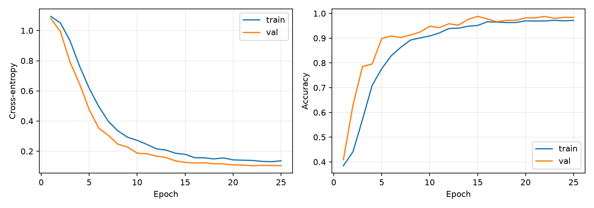
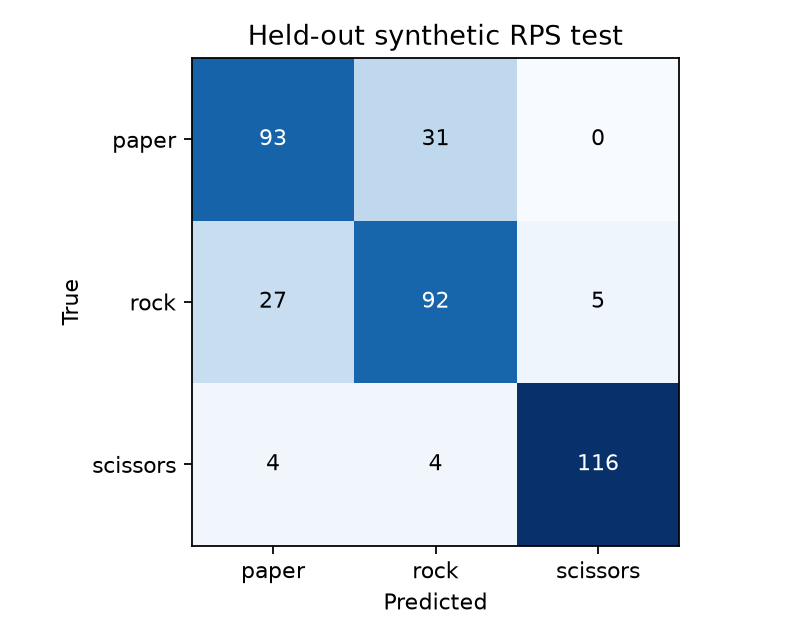

# v0.1.0 · 灰度手势分类教学基线

状态：**已完成一次真实训练与独立测试；高准确率目标未达成，待用户阶段确认。**

记录日期：2026-10-04（Asia/Shanghai）。

## 本版范围

从已有 PyTorch CUDA 环境建立可复现的小型 CNN，搭配三本 Jupyter 教程、模块化 Python 实现、数据下载与划分、实验输出以及私有 GitHub PR 流程。INT8 转换与实际 FPGA 部署仍是后续阶段。

## 已测基线

| 项目 | 结果 |
|---|---|
| 输入 | 64×64×1 灰度，float32 [0,1] |
| 类别顺序 | paper / rock / scissors |
| 参数量 | **7,427** |
| 卷积与全连接 MACs | **2,655,744 / 图** |
| 全部参数按 1 byte 粗估 | 7.25 KiB，仅帮助理解数量级 |
| 训练 / 验证 / 测试 | 2,016 / 504 / 372 |
| 训练配置 | seed 42，25 epochs，batch 64，Adam，初始 LR 0.001 |
| 最佳轮次 | 第 22 轮，按验证 accuracy 优先、loss 次优选择 |
| 验证 accuracy | **98.81%** |
| 官方独立测试 accuracy | **80.91%（301/372）** |
| 官方独立测试 macro-F1 | **0.8100** |
| 板端 FPS | 未测 |
| INT8 精度 / 模型文件 | 尚未导出 |

FP32 权重保存在本地 `artifacts/rps-v0.1-baseline/best.pt`。详细 JSON 报告与环境快照放在本目录。INT8 粗估不包括模型元数据、INT32 bias、量化参数和激活内存，不能等同于最终 `.tflite` 文件大小。

三本 notebook 均通过真实 Jupyter kernel 完整执行。Notebook 02 重复运行相同配置，25 轮全部损失/准确率与命令行基线一致，测试混淆矩阵一致；见 [执行验证记录](notebook_verification.json)。基线训练循环耗时约 26.94 秒，不包括初次下载与数据加载，不能用来推断 FPGA 推理速度。



## 测试混淆矩阵

行是真实类别，列是预测类别。

| 真实 \ 预测 | paper | rock | scissors |
|---|---:|---:|---:|
| paper | 93 | 31 | 0 |
| rock | 27 | 92 | 5 |
| scissors | 4 | 4 | 116 |



## 如何解释这个结果

验证结果较高，独立测试下降约 17.9 个百分点。随机图片验证可能含同一渲染序列的相近姿态，因此这个验证协议不足以评估跨场景泛化。本次公开数据分布也不能替代真实 AR0135 的光照、曝光、裁剪与背景条件。

本版没有达到拟定的公开测试 accuracy ≥95% 门槛，也没有证明任意实拍可用。保留这个失败基线有教学价值：它说明需要同时审视数据协议与模型，而不是只看训练曲线。

下一轮优先按可追踪的渲染序列分组做开发验证；文件名前缀只能视为序列线索，不能未经证实当作人的身份。实拍数据按人/会话/背景分组，并补充 background/other。先依据开发验证比较增强和结构，再冻结候选。已经观察过本次官方测试，后续改动需另留未使用的真实最终验收集，不能无限反复用这 372 张宣称独立验收。

## 复现

```bat
conda activate CNN-Tutorial
python scripts/prepare_data.py
python scripts/train.py --epochs 25 --run rps-baseline-repeat --test
python -m unittest discover -s tests -v
python scripts/check_notebooks.py
```

或者按 00→01→02 执行 notebook。数据摘要来自实际下载后的文件，当前版本与 manifest SHA-256 记录于 JSON。不同软硬件版本可能产生差异，不能仅凭相同 seed 保证跨环境完全一致。

## 版本审查重点

- 训练、验证与测试分离；增强只作用于训练集。
- 测试指标由保存的验证最优 checkpoint 生成。
- 统一灰度、尺寸、数值范围与类别顺序。
- 所有 notebook 代码 cell 前有 Markdown 解释。
- 原始资料、数据、模型权重、token 与临时文件不进入 Git。
- MAIN 所有阶段仍未勾选，等待用户验收。
