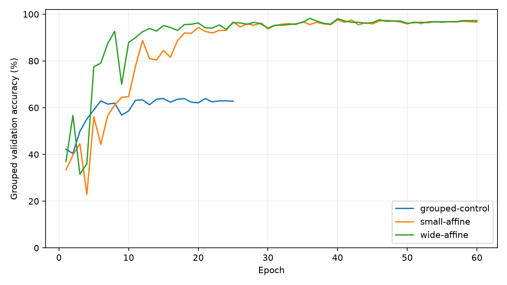
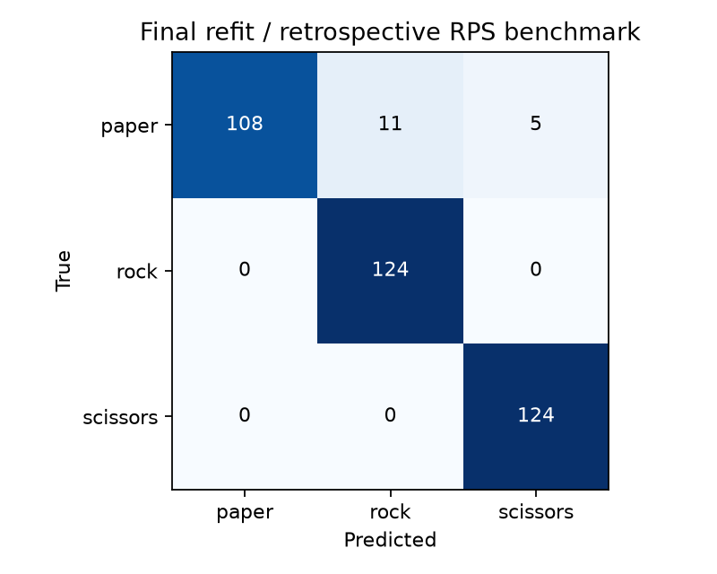

# v0.2.0 · 分组验证与训练优化

日期：2026-10-04（Asia/Shanghai）。状态：代码、开发实验与最终训练已执行；等待用户阶段确认。整体 FPGA 项目尚未完成。

## 开发实验结果

统一开发划分为 1,800 训练 / 720 验证；每类完整保留两个序列。所有候选均为 seed 42。

| 候选 | 参数 | 轮数 | 分组验证 accuracy | 最佳轮次 |
|---|---:|---:|---:|---:|
| grouped-control：基础配置 | 7,427 | 25 | 63.89% | 18 |
| small-affine：增强 + 更长训练 | 7,427 | 60 | 97.64% | 40 |
| wide-affine：通道翻倍 + 同一策略 | 26,371 | 60 | **98.19%** | 36 |

按 [预先保存的计划](plan.json) 选择 `wide-affine`，冻结 [选模记录](selection.json) 及 checkpoint 哈希后才评估官方测试。开发候选测试 accuracy 为 93.28%，见 [冻结候选的测试结果](selected_test.json)。此时官方测试已经在 v0.1 被观察过，因此不是新的盲测。

## 最终训练结果

采用开发选中的结构和策略，把完整官方训练池 2,520 张图用于重新训练；固定 36 轮，保持原候选的 LR horizon=60，不再根据测试调参，也不在合并后的训练池上早停。见 [最终训练协议](refit/protocol.json)。

| 指标 | 结果 |
|---|---|
| 输入 | 64×64×1，灰度 float32 [0,1] |
| 参数 | **26,371** |
| Conv/Linear MACs | **10,030,080 / 图** |
| 官方基准 accuracy | **95.70%（356/372）** |
| 官方基准 macro-F1 | **0.9563** |
| paper recall | **87.10%** |
| rock / scissors recall | 100% / 100%（仅本测试集） |
| 相对 v0.1 accuracy | +14.78 个百分点 |
| 最终模型独立开发验证 | 无，原验证样本已用于最终训练 |
| INT8 / 板上 FPS | 未验证 |

原始 [测试 JSON](refit/test_metrics.json) 与 [模型规模/数据摘要](refit/summary.json) 保留实际数值。测试矩阵的行是真实类别，列是预测类别。

该结果达到之前拟定的公开基准平均 accuracy/F1 门槛，但 paper 的召回率仍偏低，不能据此宣称所有手势或实际相机均达到 95%。只有 372 张合成测试图；还缺跨人、跨会话、背景拒识和传感器域差异评估。

## 产物与复现

- 最终权重（本地）：`artifacts/v0.2-grouped-study/refit/best.pt`。
- 权重 SHA-256：`ed3e422f75b1765953cddc91fd49ab0f140e43f5c2c72e2a69785930365972ad`。
- 分组开发的三组结果、完整曲线与选模证据均保存为本目录 JSON。
- 最终训练的配置、曲线与测试独立放在 `refit/`。
- `source_provenance.json` 是训练结束后采集的实际 model/data/training 源码摘要；这三个源文件在实验期间未改动。
- 教程：[Notebook 03](../../../notebooks/03_grouped_optimization.ipynb)；默认回放记录，开启 `RUN_TRAINING` 重新执行完整训练流程。

本次检查包括默认模型接口兼容、宽模型参数预算、序列互斥/测试成员不变，以及实际 notebook 回放执行。原 v0.1 权重仍可加载与推理。CPU CI 只负责代码与 notebook 契约，不能证明图像识别精度或板卡性能。

下一步固定最终权重，进行 PyTorch→Keras 数值一致性、训练池校准和 INT8 回归。MAIN 阶段保持未勾选。
